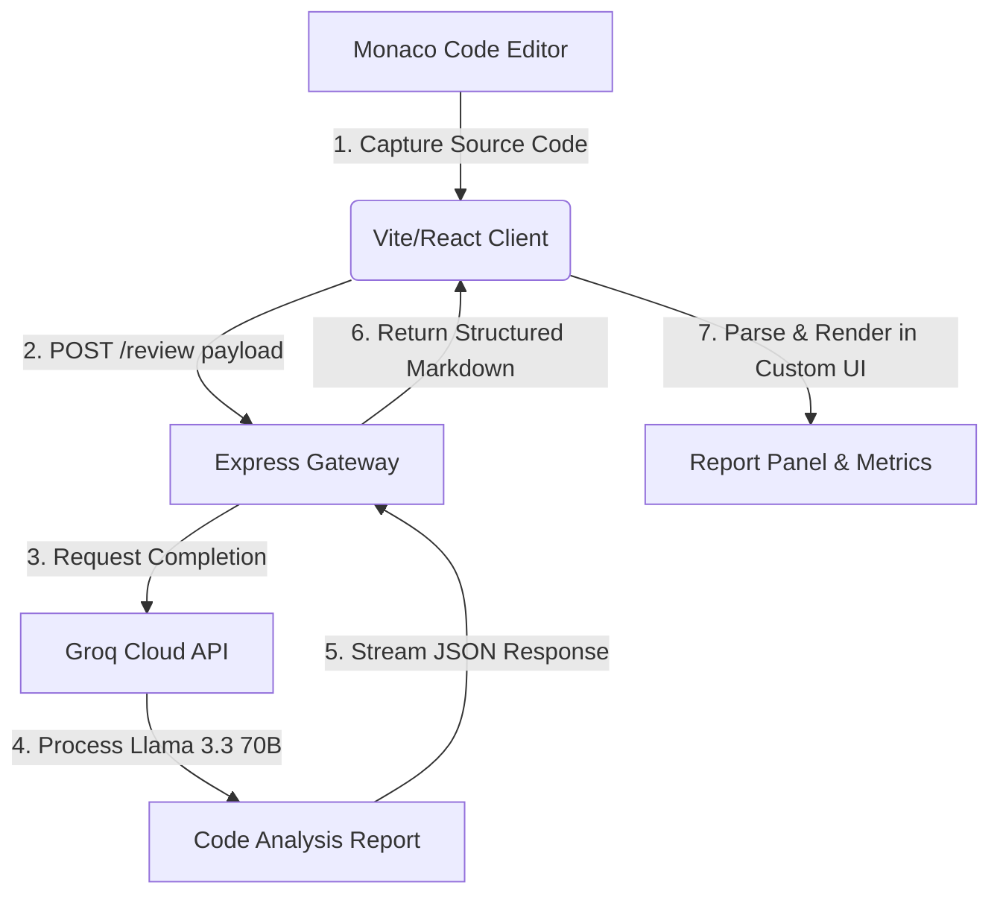

# LYADH CODE 🚀

[](https://vite.dev/)
[](https://react.dev/)
[](https://nodejs.org/)
[](https://expressjs.com/)
[](https://groq.com/)
[](https://opensource.org/licenses/MIT)

**LYADH CODE** is a premium, real-time AI-powered code reviewer. Built with a futuristic developer-centric interface, it allows developers to write or paste source code in an interactive Monaco editor, instantly analyze it against five distinct code-quality metrics, and generate detailed, downloadable markdown and PDF reports.

The backend leverages **Groq's Llama 3.3 70B** engine to provide near-instantaneous feedback, highlighting logic bugs, security vulnerabilities, performance bottlenecks, and best practice recommendations alongside a fully refactored and clean code version.

---

## 🔗 Live Deployments

*   **Frontend Dashboard:** [https://lyadh-code.vercel.app/](https://lyadh-code.vercel.app/)
*   **Backend Review API:** [https://lyadh-code-backend.onrender.com/review](https://lyadh-code-backend.onrender.com/review)

---

## 🏛️ System Architecture



1.  **Code Ingestion:** Code is captured locally using the embedded Monaco Editor workspace.
2.  **Payload Dispatch:** Axios transmits the JSON payload containing the source code to the Express backend.
3.  **LLM Processing:** The backend interfaces with the high-speed Groq SDK, generating a complete review using `llama-3.3-70b-versatile` under a curated system prompt.
4.  **UI Representation:** The frontend parses the markdown results and updates dynamic dashboard statistics (e.g. complexity, maintainability, and security scores).

---

## ✨ Features & Capabilities

### 🎨 Modern Developer-Centric Theme
*   **Aesthetic Background:** Ambient terminal grids, floating green glow particles, and custom circuit trace vector drawings.
*   **Stealth Mode / High Contrast:** One-click toggling between a neon cyberpunk theme and a high-contrast black minimal mode.
*   **Responsive Layout:** The grid adapts instantly from 4K/desktop wide-screen modes down to compact mobile viewports.

### 💻 Monaco Editor Workspace
*   **Language Selector:** Dropdown selector to style the editor with proper formatting rules (JavaScript, Python, C++, Java, etc.).
*   **Controls:** Fullscreen expansion mode for deep coding sessions and quick refresh controls to clear buffers.
*   **Metadata Footer:** Real-time character counts, line counts, and automatic save status badges.

### 🤖 Granular AI Diagnostics & Export
*   **Pre-flight Checks:** A visual "Ready for Review" checklist illustrating the scope of analysis.
*   **Step-by-step Loader:** Interactive progress overlay highlighting each analysis stage (syntax, security, performance, and best practices).
*   **Export Actions:** One-click downloads to save reports as local Markdown (`.md`) or trigger standard system PDF print templates.

---

## 🛠️ Tech Stack & Dependencies

### Frontend (`/frontend`)
*   **React 19 & Vite 8:** High-speed dev compilation and client routing.
*   **Monaco Editor (`@monaco-editor/react`):** Professional syntax highlighting and editor layout.
*   **Framer Motion 12:** Smooth, premium transitions, modal entries, and metric loaders.
*   **React Markdown:** Safe rendering of AI markdown outputs.
*   **Lucide Icons & React Icons:** Consistent, beautiful developer icons.

### Backend (`/backend`)
*   **Node.js & Express 5:** Fast HTTP server.
*   **Groq SDK:** High-performance integration with Groq API endpoints.
*   **Dotenv & CORS:** Clean environment loading and cross-origin security.

---

## 📂 Project Structure

```bash
LYADH_CODE/
├── frontend/                  # React + Vite client app
│   ├── src/
│   │   ├── components/        # Loading overlays, ParticlesBg, Logo
│   │   ├── App.jsx            # Main app page logic
│   │   ├── index.css          # Cyberpunk typography and design system
│   │   └── main.jsx
│   ├── package.json
│   └── vite.config.js
│
├── backend/                   # Express Gateway server
│   ├── server.js              # API logic & Groq handler
│   └── package.json
│
└── README.md                  # Professional documentation
```

---

## ⚙️ Installation & Local Setup

### 1. Clone the Workspace
```bash
git clone https://github.com/Jarjis-Alam/LYADH_CODE.git
cd LYADH_CODE
```

### 2. Configure Backend Gateway
Change to the backend directory and install Node modules:
```bash
cd backend
npm install
```

Create a `.env` configuration file in the `backend/` root directory:
```env
GROQ_API_KEY=gsk_your_actual_groq_api_token_here
```

Launch the local development API:
```bash
npm start
```
*The server will run on [http://localhost:5000](http://localhost:5000).*

### 3. Configure Frontend Client
In a new terminal workspace, navigate to the frontend folder and install modules:
```bash
cd frontend
npm install
```

*(Optional)* Create a `.env` file in the `frontend/` directory to override the API target:
```env
VITE_BACKEND_URL=http://localhost:5000
```

Start the Vite web application:
```bash
npm run dev
```
*The frontend portal will open on [http://localhost:5173](http://localhost:5173) (or next available port).*

---

## 🧪 Testing Code Review

To verify correct operation, paste the following snippet into the Monaco Editor and click **Review Code (Ctrl + Enter)**:

```python
def calculate_average(numbers):
    total = 0

    # Bug: range goes out of bounds
    for i in range(len(numbers) + 1):
        total += numbers[i]

    # Vulnerability: potential division by zero
    average = total / len(numbers)

    print("Average:", average)
    return average

data = []
calculate_average(data)
```

The Groq AI engine will detect and report:
1.  **IndexOutOfBoundsException** risk inside the loop range.
2.  **ZeroDivisionError** hazard when testing empty arrays.
3.  **Refactored Version** with proper boundary guards and array length checks.

---

## 👨‍💻 Developer Profile

**Munshi Jarjis Alam**
*   **Academic:** Third-Year B.Tech Student in Computer Science & Technology
*   **Institution:** Institute of Engineering & Management (IEM), Kolkata
*   **Focus:** Full-stack software engineering, artificial intelligence integrations, UI/UX aesthetics, and product design.

*Built with ❤️ to help developers write clean, robust, and performant code.*
